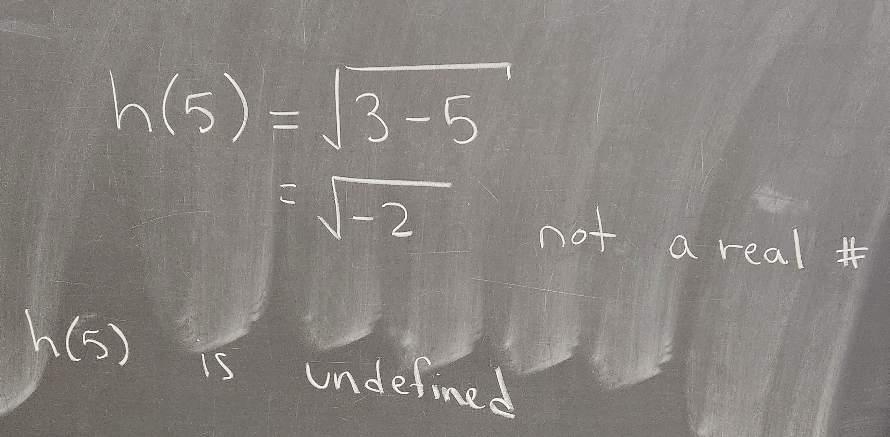

```{r setup, include=FALSE}
knitr::opts_chunk$set(echo = TRUE)
```

## Example Analysis

Consider $h(x) = \sqrt{3-x}$. First we evaluate at $x=-4$.

We see that $h(-4)=\sqrt{7}$. We can also evaluate approximately in R.
```{r}
h <- function(x){sqrt(3-x)}
h(-4)
```

We also evaluate $h$ at $x=5$. We see in the work below that the value $h(5)$ is undefined. 

The warning we see in R is because $h(5)$ is an undefined value.
```{r}
h(5)
```